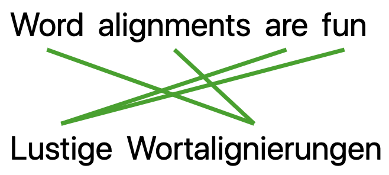

SimAlign: Similarity Based Word Aligner - Online Demo
==============

<p align="center">
    <br>
    
    <br>
<p>


Simple flask app that wraps the alignment algorithm from [this paper](https://www.aclweb.org/anthology/2020.findings-emnlp.147.pdf) and this [code](https://github.com/cisnlp/simalign). It uses flask as webserver, gunicorn server for production, d3.js for visualization. 
See the online version [here](https://simalign.cis.lmu.de/).

If you are interested in word aligned corpore check out our demo that lets you browse more than 1000 languages: [ParCourE](http://parcoure.cis.lmu.de/).


Usage
------
Install requirements and [SimAlign](https://github.com/cisnlp/simalign). 

If `CIS=False` in `app/utils.py`, it is easier to test locally (as no BERT models are loaded into memory and also SimAlign is not required). For deployment set `CIS=True`.

Create local secrets (do not put true secrets repos) like this: 
```bash
export FLASK_SECRET_KEY="neverguessing"
export CAPTCHA_SITE_KEY='createonline'
export CAPTCHA_SECRET_KEY='createonline'
```
You need to create the captcha keys online or you set it to something meaningless (then captcha does not work which is fine for testing the app). 

Then set 
`export FLASK_APP=align.py`
and run 
`flask run`. 

For the actual deployment run:
```bash
gunicorn --config gunicorn_config.py demo:app
```

<!-- Use environment ```myenv transnew``` -->


       

Publication
--------

If you use the code, please cite 

```
@inproceedings{jalili-sabet-etal-2020-simalign,
    title = "{S}im{A}lign: High Quality Word Alignments without Parallel Training Data using Static and Contextualized Embeddings",
    author = {Jalili Sabet, Masoud  and
      Dufter, Philipp  and
      Yvon, Fran{\c{c}}ois  and
      Sch{\"u}tze, Hinrich},
    booktitle = "Proceedings of the 2020 Conference on Empirical Methods in Natural Language Processing: Findings",
    month = nov,
    year = "2020",
    address = "Online",
    publisher = "Association for Computational Linguistics",
    url = "https://www.aclweb.org/anthology/2020.findings-emnlp.147",
    pages = "1627--1643",
}
```

Feedback
--------
Feedback and Contributions more than welcome! Just reach out to @pdufter. 


License
-------
Copyright (C) 2020, Philipp Dufter

A full copy of the license can be found in LICENSE.


TODOs
------
* add embedding similarities to edges
* update simalign library

